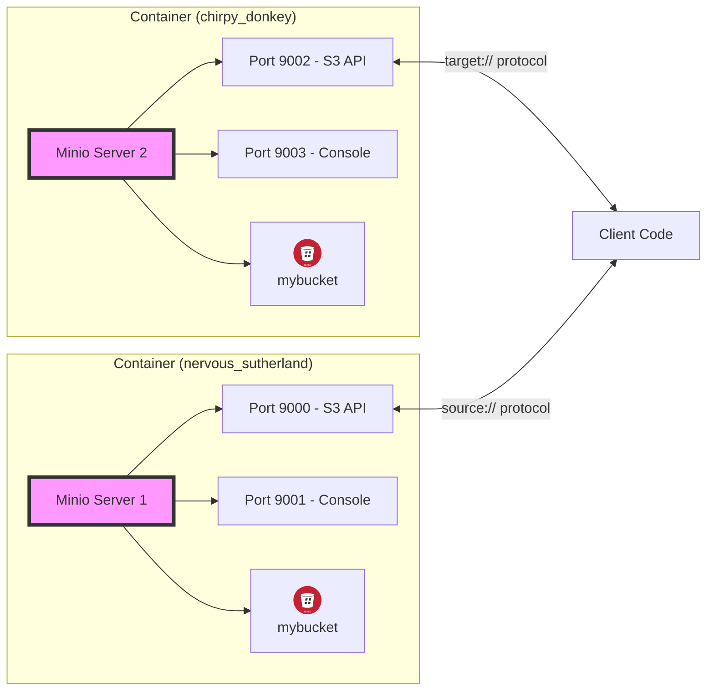

```python
%%capture
%xmode Minimal
import logging, warnings

warnings.filterwarnings("ignore")
logging.basicConfig(level=logging.CRITICAL)
!docker stop chirpy_donkey nervous_sutherland
!docker rm chirpy_donkey nervous_sutherland
```

Here is a neat method I found to make accessing blob
storage extremely painless in the Python data eco-system. It's especially nice since the tools
it relies on are extremely widely supported. So if that sounds interesting read on.

The code to for to produce this article can be [found here](https://github.com/Nintorac/fsspec-fun/blob/main/article.py), or if you prefer a `.ipynb` then [check here](https://github.com/Nintorac/fsspec-fun/blob/main/build/article.ipynb)

<details>
<summary>
A quick note on article format (click to expand)
</summary>
---
This article is a little experimental, I want to be able to produce content with executed Python
it works OK but is a little convoluted. I think I will end up migrating my site platform to MyST or Sphinx in the future to make it easier.

Check out [github.com/Nintorac/fsspec-fun](https://github.com/Nintorac/fsspec-fun) for the sources.

You should know, when you see a block of Python, the content after it is the output of that bit of code.

eg. printing to console


```python
print("This code is being executed, and the next box is the output\nit works exactly like it would in a jupyter notebook")
```

    This code is being executed, and the next box is the output
    it works exactly like it would in a jupyter notebook


or displaying a variable directly


```python
123456
```


    123456


---
</details>

## Getting started

First we are going to install a few dependencies.


```python
!pip install --disable-pip-version-check --root-user-action=ignore -q \
    fsspec pandas
import fsspec, pandas as pd
```

fsspec which is the star of the article, and Pandas to demonstrate some of the neat interoperability
(but this works with many other libraries eg DuckDB, Polars..[etc](https://filesystem-spec.readthedocs.io/en/latest/#who-uses-fsspec))

fsspec is a neat little tool that aims to provide a unified interface to files wherever they live,
be that locally, in a zip, on http or even FTP! Heres the full list of [built in implementations](https://filesystem-spec.readthedocs.io/en/latest/api.html#built-in-implementations)
and a list of [other known implementations](https://filesystem-spec.readthedocs.io/en/latest/api.html#other-known-implementations)

For example;


```python
fs = fsspec.filesystem('file')
with fs.open('example_file','w') as f:
    f.write('hello')

!cat example_file
```

    hello

Here we create a file named `example_file` in the current working directory, write some text into it and then escape to shell to
print the file using cat.

Here's another example;


```python
fs = fsspec.filesystem('memory')
with fs.open('example_file','w') as f:
    f.write('a,b,c\n1,2,3')

df = pd.read_csv('memory://example_file')
df
```


<div>
<style scoped>
    .dataframe tbody tr th:only-of-type {
        vertical-align: middle;
    }

    .dataframe tbody tr th {
        vertical-align: top;
    }

    .dataframe thead th {
        text-align: right;
    }
</style>
<table border="1" class="dataframe">
  <thead>
    <tr style="text-align: right;">
      <th></th>
      <th>a</th>
      <th>b</th>
      <th>c</th>
    </tr>
  </thead>
  <tbody>
    <tr>
      <th>0</th>
      <td>1</td>
      <td>2</td>
      <td>3</td>
    </tr>
  </tbody>
</table>
</div>


This time we use the 'memory' filesystem, an ephemeral in memory filesystem provided by fsspec
out of the box. We write a csv to it, and then use pandas to read the csv directly.

So pandas supports fsspec out of the box!

## Bucket storage

Ok, lets get a bit more fancy;


```python
!docker run --name nervous_sutherland --rm -d \
  -p 9000:9000 \
  -p 9001:9001 \
  -e "MINIO_ROOT_USER=minio" \
  -e "MINIO_ROOT_PASSWORD=123456789" \
  quay.io/minio/minio server /data --console-address ":9001"
!sleep 2
!docker exec nervous_sutherland bash -c \
    "mc alias set myminio http://localhost:9000 minio 123456789 && \
    mc mb myminio/mybucket"

!pip install --disable-pip-version-check --root-user-action=ignore -q \
      s3fs
```

    3bd79abde39850ba8dcc29028457ff5a64ec37b7db5f5ece167b60a8197e310e


    Added `myminio` successfully.


    Bucket created successfully `myminio/mybucket`.


We started a Minio server as a quick and easy alternative to S3, if you are following along
from home and already have access to S3 then you can use that just as easily!

Then we create a bucket in the minio server called `mybucket`.

Finally, we installed `s3fs`, this is an fsspec backend that allows you to access any s3 compatiable.
So lets try the last example again, but writing to s3 now;


```python
fs = fsspec.filesystem(
    's3',               # this setting tells fsspec to use the s3fs package
    key = 'minio',
    secret = '123456789',
    endpoint_url = 'http://localhost:9000'
)
with fs.open('mybucket/example_file','w') as f:
    f.write('a,b,c\n1,2,3')

df = pd.read_csv('s3://mybucket/example_file')
df
```


    PermissionError: Forbidden


Wait, hang on..permission denied?

Ah! when I use `s3://` protocol with pandas it is not supplying my custom configuration
so its reaching out to the real s3 with my bogus credentials and so...Forbidden!

The solve?


```python
with fs.open('mybucket/example_file','r') as f:
    df = pd.read_csv(f)
df
```


<div>
<style scoped>
    .dataframe tbody tr th:only-of-type {
        vertical-align: middle;
    }

    .dataframe tbody tr th {
        vertical-align: top;
    }

    .dataframe thead th {
        text-align: right;
    }
</style>
<table border="1" class="dataframe">
  <thead>
    <tr style="text-align: right;">
      <th></th>
      <th>a</th>
      <th>b</th>
      <th>c</th>
    </tr>
  </thead>
  <tbody>
    <tr>
      <th>0</th>
      <td>1</td>
      <td>2</td>
      <td>3</td>
    </tr>
  </tbody>
</table>
</div>


Yuck! All those nice ergonomics are gone, a whole extra line of code..let's do better!

## Custom Protocol Defintions

After forgetting about this problem for some time I came across `UPath`, this is another library
from the fsspec project that adds `pathlib.Path` capabilites to fsspec endponts. More on that later...
but in the [README](https://github.com/fsspec/universal_pathlib/blob/3cc0871/README.md) for this library in an out of context example, we find a hint!

Here is the relevant excerpt;
```python3
import fsspec.registry
from fsspec.spec import AbstractFileSystem

class MyProtoFileSystem(AbstractFileSystem):
    protocol = ("myproto",)
    ...  # your custom implementation

fsspec.registry.register_implementation("myproto", MyProtoFileSystem)
```

So let's try something;


```python
from fsspec import register_implementation
from s3fs import S3FileSystem

class MyProtoFileSystem(S3FileSystem):
    protocol = ('fsspecfun',) # Name of the custom protocol

    def __init__(self, *args, **_):
        super().__init__(
            *args,
            # Configuration we inject into the base protocol
            key = 'minio',
            secret = '123456789',
            endpoint_url = 'http://localhost:9000'
        )

register_implementation("fsspecfun", MyProtoFileSystem) # register the protocol with fsspec

df = pd.read_csv('fsspecfun://mybucket/example_file')
df
```


<div>
<style scoped>
    .dataframe tbody tr th:only-of-type {
        vertical-align: middle;
    }

    .dataframe tbody tr th {
        vertical-align: top;
    }

    .dataframe thead th {
        text-align: right;
    }
</style>
<table border="1" class="dataframe">
  <thead>
    <tr style="text-align: right;">
      <th></th>
      <th>a</th>
      <th>b</th>
      <th>c</th>
    </tr>
  </thead>
  <tbody>
    <tr>
      <th>0</th>
      <td>1</td>
      <td>2</td>
      <td>3</td>
    </tr>
  </tbody>
</table>
</div>


Well..it seems to be working but...whats happening here?!

First up we are creating a sub-class of `S3FileSystem`, this is the class that we are fetching when we ran
`fsspec.filesystem('s3')`, convince yourself like this; `type(fsspec.filesystem('s3'))==S3FileSystem`.

This is also the class that implements the fssspec protocol, so our subclass will also implement it!

Then we override this protocol variable..this let's fsspec know when to use this backend implementation.
eg for the `S3FileSytem` this value is `('s3',)`

Next we override the init function, here we ignore any of the fsspec storage options and inject our own.

Once we have the implementation in place, we register it with fsspec, passing in the protocol name again here
-- not sure why it's configured twice, but they both have to match for things to work.

Finally, we read the csv again, but this time we replace the `s3` protocol from the initial attempt with the new one: `fsspecfun`

## Custom Protocol Use cases

Neat, it works! Let's take the idea and glam it up a little;


```python
def register_custom_fs_protocol(protocol: str, base_protocol: str, storage_options: dict[str, str], *, clobber: bool = False):
    """Register a custom fsspec protocol that applies some storage configuration."""
    overwrite_protocol = protocol

    class MyProtoFileSystem(type(fsspec.filesystem(base_protocol))):
        protocol = (overwrite_protocol,)

        def __init__(self, *args, **_):  # noqa: N804
            super().__init__(*args, **storage_options)

    fsspec.register_implementation(protocol, MyProtoFileSystem, clobber)
```

In this new version we create the handler class on the fly, you can base it off any fsspec implementation
([full list here](https://filesystem-spec.readthedocs.io/en/latest/api.html#other-known-implementations)) and you can 
give the protocol whatever name you like.

So let's use it to register some custom protocols - to demonstrate this I'll deploy another minio server, and we will backup the example file from the original server to the new one.


```python
!docker run --name chirpy_donkey --rm -d \
  -p 9002:9000 \
  -p 9003:9001 \
  -e "MINIO_ROOT_USER=minio" \
  -e "MINIO_ROOT_PASSWORD=987654321" \
  quay.io/minio/minio server /data --console-address ":9001"
!sleep 2
!docker exec chirpy_donkey bash -c \
    "mc alias set myminio http://localhost:9000 minio 987654321 && \
    mc mb myminio/mybucket"
```

    b935861911a5d1d0ec55e47766d23dfc571aa0dd6764fb1810522fd694ede1ad


    Added `myminio` successfully.
    Bucket created successfully `myminio/mybucket`.


<a id="infra"></a>
Here is a quick diagram to try to illustrate the architecture of the infrastructure at this point.
It is rendered a bit more nicely in the repo, [here](https://github.com/Nintorac/fsspec-fun/blob/main/build/article.md#infra)




So with both the servers deployed and ready, let's register the `source` and `target` protocol to use in the backup scenario.


```python
# register `source` protocol that connects to the minio instance
register_custom_fs_protocol(
    'source',
    's3',
    {'key' : 'minio', 'secret' : '123456789', 'endpoint_url' : 'http://localhost:9000'}
)
# register `target` protocol that connects to the real s3
register_custom_fs_protocol(
    'target',
    's3', 
    {'key' : 'minio', 'secret' : '987654321', 'endpoint_url' : 'http://localhost:9002'}
)
```

And finally we can run the backup.

This may seem a bit weird that we open the file and then use a `with` block,
you can read the docs [here](https://filesystem-spec.readthedocs.io/en/latest/features.html#openfile-instances) to better understand what's happening.


```python
source = fsspec.open('source://mybucket/example_file')
target = fsspec.open('target://mybucket/backup_file', 'wb')

with (source as source_f, target as target_f):
    target_f.write(source_f.read())

df = pd.read_csv('target://mybucket/backup_file')
df
```


<div>
<style scoped>
    .dataframe tbody tr th:only-of-type {
        vertical-align: middle;
    }

    .dataframe tbody tr th {
        vertical-align: top;
    }

    .dataframe thead th {
        text-align: right;
    }
</style>
<table border="1" class="dataframe">
  <thead>
    <tr style="text-align: right;">
      <th></th>
      <th>a</th>
      <th>b</th>
      <th>c</th>
    </tr>
  </thead>
  <tbody>
    <tr>
      <th>0</th>
      <td>1</td>
      <td>2</td>
      <td>3</td>
    </tr>
  </tbody>
</table>
</div>


## Closing Thoughts

So we learned how to use fsspsec to provide a unified access model to many types of filesystems (S3, GCS, FTP, HTTP, etc)
that is useable by a diverse set of analytics libraries (DuckDB, Polars, Pandas, etc.). 

Then we learned how to extend fsspec to inject credentials and configuration into the clients for the filesystems, 
hopefully that can help reduce some boilerplate in your code and cleaner analytics pipelines!

Overall I think the folks working on the fsspec project are doing a great job of implementing a unified storage layer for Python. Go have an
explore of [github.com/fsspec](https://github.com/fsspec) to learn more about this project!

And that's about all I have to show..hope you learned something useful!
<detail>
<summary>
Cleanup and dependencies
</summary>


```python
!docker stop chirpy_donkey nervous_sutherland
!pip list --format=freeze
```

    chirpy_donkey
    nervous_sutherland


    aiobotocore==2.15.2
    aiohappyeyeballs==2.4.3
    aiohttp==3.11.7
    aioitertools==0.12.0
    aiosignal==1.3.1
    asttokens==2.4.1
    attrs==24.2.0
    beautifulsoup4==4.12.3
    bleach==6.2.0
    botocore==1.35.36
    cffi==1.17.1
    comm==0.2.2
    debugpy==1.6.7
    decorator==5.1.1
    defusedxml==0.7.1
    duckdb==1.1.3
    exceptiongroup==1.2.2
    executing==2.1.0
    fastjsonschema==2.21.0
    frozenlist==1.5.0
    fsspec==2024.10.0
    idna==3.10
    importlib_metadata==8.5.0
    ipykernel==6.29.5
    ipython==8.29.0
    jedi==0.19.2
    Jinja2==3.1.4
    jmespath==1.0.1
    jsonschema==4.23.0
    jsonschema-specifications==2024.10.1
    jupyter_client==8.6.3
    jupyter_core==5.7.2
    jupyterlab_pygments==0.3.0
    jupytext==1.16.4
    markdown-it-py==3.0.0
    MarkupSafe==3.0.2
    matplotlib-inline==0.1.7
    mdit-py-plugins==0.4.2
    mdurl==0.1.2
    mistune==3.0.2
    multidict==6.1.0
    nbclient==0.10.1
    nbconvert==7.16.4
    nbformat==5.10.4
    nest_asyncio==1.6.0
    numpy==2.1.3
    packaging==24.2
    pandas==2.2.3
    pandocfilters==1.5.1
    parso==0.8.4
    pexpect==4.9.0
    pickleshare==0.7.5
    pip==24.2
    platformdirs==4.3.6
    prompt_toolkit==3.0.48
    propcache==0.2.0
    psutil==5.9.0
    ptyprocess==0.7.0
    pure_eval==0.2.3
    pycparser==2.22
    pygit2==1.16.0
    Pygments==2.18.0
    python-dateutil==2.9.0.post0
    pytz==2024.2
    PyYAML==6.0.2
    pyzmq==25.1.2
    referencing==0.35.1
    rpds-py==0.21.0
    s3fs==2024.10.0
    setuptools==75.1.0
    six==1.16.0
    soupsieve==2.6
    stack-data==0.6.2
    tinycss2==1.4.0
    tornado==6.4.1
    traitlets==5.14.3
    typing_extensions==4.12.2
    tzdata==2024.2
    universal_pathlib==0.2.5
    urllib3==2.2.3
    wcwidth==0.2.13
    webencodings==0.5.1
    wheel==0.44.0
    wrapt==1.17.0
    yarl==1.18.0
    zipp==3.21.0


</details>
